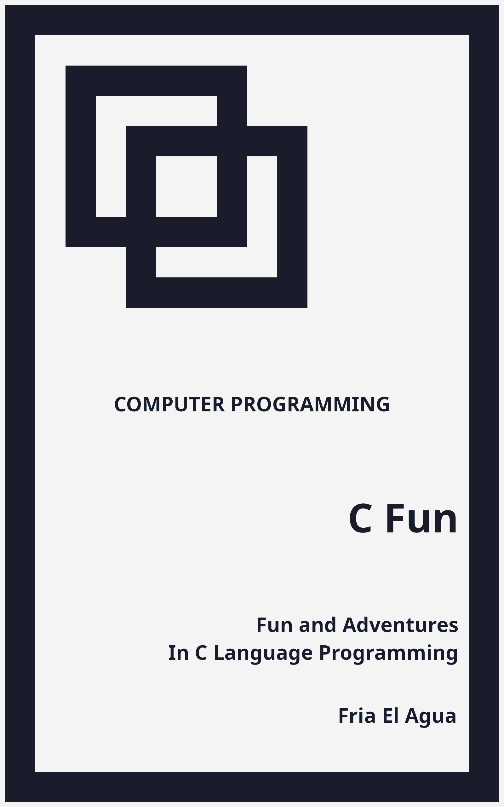

# C Fun
## Fun and Adventures in C Language Programming
### By Fria El Agua

1. Front Matter
2. Body Matter
    1. Essentials
        1. [Compiling and Running](essentials/compiling_and_running.md)
        2. [Input and Output Basics](essentials/input_and_output_basics.md)
        3. [Conditional Statements](essentials/conditional_statements.md)
    2. Data Structures
        1. [Linked List](data_structures/linked_list.md)
        2. [Stack](data_structures/stack.md)
        3. [Queue](data_structures/queue.md)
    3. Algorithms
        1. Random Shuffle
        2. Run Length Encoding
    4. Games
    	  1. Graphics
    	  2. Input
    	  4. Audio
3. Back Matter

