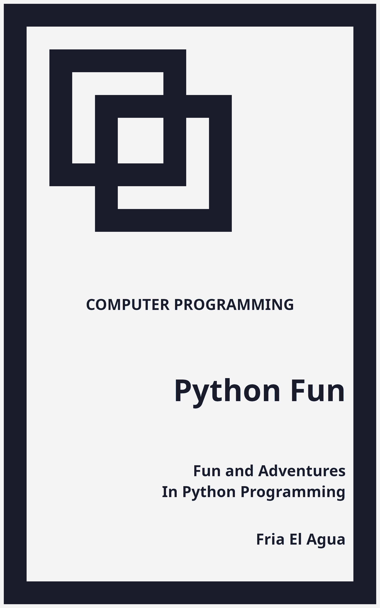

# Python Fun
## Fun and Adventures in Python Programming
### By Fria El Agua

1. Front Matter
2. Body Matter
    1. Essentials
    2. Data Structures
        1. [Linked List](body_matter/data_structures/linked_list.md)
        2. [Stack](body_matter/data_structures/stack.md)
        3. [Queue](body_matter/data_structures/queue.md)
    3. Algorithms
    4. Games
    	  1. [Graphics](body_matter/games/graphics.md)
    	  2. [Input](body_matter/games/input.md)
    	  4. [Audio](body_matter/games/audio.md)
3. Back Matter

